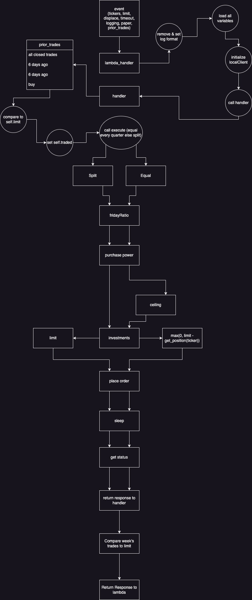

# alpaca-trading

## Description

Used to make trades on [Alpaca](https://alpaca.markets/) based on supplied configurations.

This code is meant to be hosted on an AWS Lambda instance and called by AWS EventBridge Scheduler. Scheduled to execute every Friday. Logs are published every run and will alert on any errors that occur during the execution.

## Workflow


## Configuration

```json
{
  "tickers": ["VONG", "SCHD", "SCHG", "SPGP", "RSP"],
  "limit": 50,
  "displace": 5,
  "timeout": 10,
  "logging": "INFO",
  "paper": true,
  "prior_trades": true
}
```

limit: Total amount that will be invested  
displace: Day of the month that money is transfered  
timeout: How long to wait to check status

## Codeflow



## Recreating

1. Clone this repo
2. Create AWS account
3. Add AWS keys into Github secret keeper
4. Create [AWS Lambda](https://us-east-1.console.aws.amazon.com/lambda/home?region=us-east-1#/functions)
   - Change timeout to 3 min
   - Set environment variables with alpaca keys
   - Set test event
   - Add layers (python-dotenv, alpaca-py)
   - Set lambda_function.lambda_function caller in code
5. Create metric [AWS CloudWatch Metric](https://us-east-1.console.aws.amazon.com/cloudwatch/home?region=us-east-1#metricsV2:)
   - Track every occurance of "ERROR"
6. Create an [AWS CloudWatch Alarm](https://us-east-1.console.aws.amazon.com/cloudwatch/home?region=us-east-1#alarmsV2:?)
   - Calculate on sum over 0
   - Set missing data as good
   - Set notifications to email
7. Create an [AWS EventBridge Scheduler](https://us-east-1.console.aws.amazon.com/scheduler/home?region=us-east-1#schedules)
   - Input target payload from event.json
8. Verify execution on [Alpaca](https://alpaca.markets/)

## Scripts

1. create_layer_aws.sh
   - Pass in the name of a python package to create a layer in aws
2. disable_scheduler.sh
   - Pass in the name of a AWS EventBridge Scheduler to set its state to disabled
3. enable_scheduler.sh
   - Pass in the name of a AWS EventBridge Scheduler to set its state to enabled
