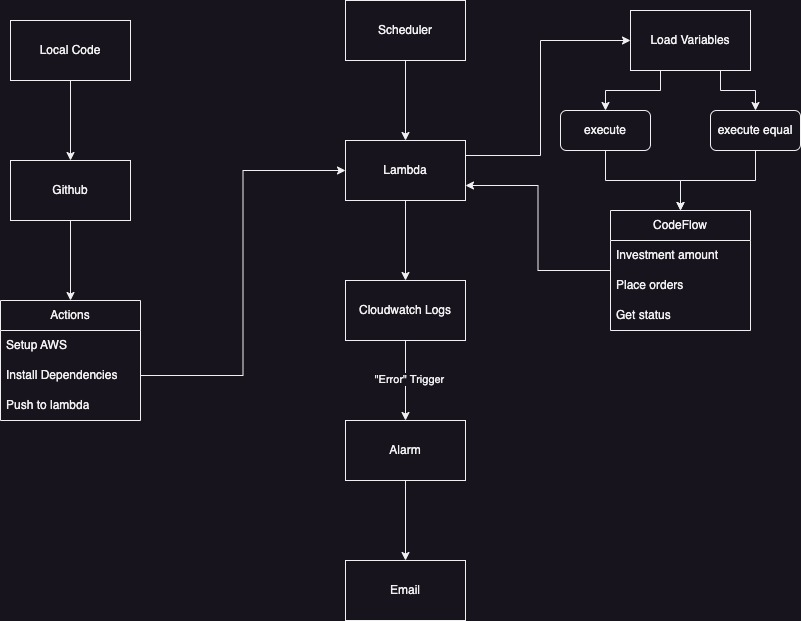

# alpaca-trading

## Description

Used to make trades on [Alpaca](https://alpaca.markets/) based on supplied configurations.

This code is meant to be hosted on an AWS Lambda instance and called by AWS EventBridge Scheduler. Scheduled to execute every Friday. Logs are published every run and will alert on any errors that occur during the execution.

## Workflow



## Configuration

```json
{
  "tickers": ["VONG", "SCHD", "SCHG", "SPGP", "RSP"],
  "limit": 100, # Total amount that will be invested
  "displace": 5, # Day of the month that money is trasnfered
  "timeout": 60, # How long to wait to check status
  "logging": "INFO",
  "paper": false
}
```

## Recreating

1. Clone this repo
2. Create AWS account
3. Add AWS keys into Github secret keeper
4. Create [AWS Lambda](https://us-east-1.console.aws.amazon.com/lambda/home?region=us-east-1#/functions)
5. Create an [AWS CloudWatch Alarm](https://us-east-1.console.aws.amazon.com/cloudwatch/home?region=us-east-1#alarmsV2:?)
6. Verify execution on [Alpaca](https://alpaca.markets/)